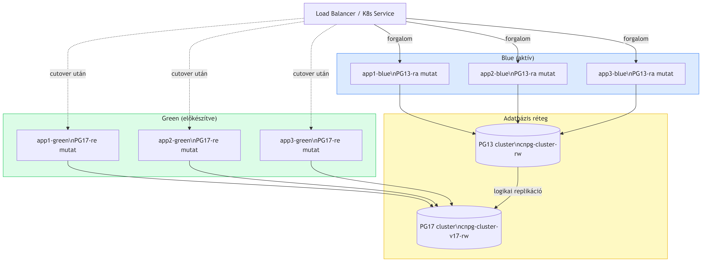

# PostgreSQL 13 → 17 migráció – Blue-Green Deployment

## Összefoglalás

A blue-green megközelítés lényege, hogy a PG17 cluster (green) logikai replikáción keresztül szinkronban van a PG13-mal (blue), így az átállás gyors és visszafordítható. Az appok egy atomikus lépésben váltanak át, nem fokozatosan – ezzel elkerülhető az adatdivergencia.

---

## Hogyan működik



A párhuzamos fázisban:
- A blue app podok PG13-ra írnak/olvasnak
- A green app podok PG17-t **csak olvasásra** használják (vagy egyáltalán nem kapnak éles forgalmat még)
- PG17 logikai replikációval szinkronban marad PG13-mal

A cutover pillanatában az összes forgalom atomikusan átkerül a green oldalra.

---

## Előkészületek (megegyeznek a logikai replikációs megközelítéssel)

1. `wal_level: logical` + publication PG13-on (lásd: `01-postgres-migration-logical-replication.md`)
2. PG17 cluster deploy (`postgresql-v17.helmfile.yml`)
3. Subscription létrehozása minden DB-re
4. Initial sync bevárása, lag monitoring

### Karbantartási idősáv és rollback határidő

A cutover tervezett karbantartási ablakban történik, alacsony forgalmú időszakban. Az ablakot előre meg kell határozni és kommunikálni.

Példa:
- **Karbantartási ablak:** 02:00 – 02:30
- **Cutover indítása:** 02:00
- **Rollback határidő:** 02:15 – ha 15 percen belül nem stabil a green oldal, visszaállítás PG13-ra
- **Ablak vége:** 02:30 – ha a rollback is megtörtént és minden stabil

A rollback határidő azért kritikus, mert minél több idő telik el a cutover után, annál több adat keletkezik PG17-en ami visszaállításkor elvész. A 15 perces határidő egy reális kompromisszum: elég idő a smoke testre, de az esetleges adatvesztési ablak még kezelhető méretű marad.

---

## Green app deployment

Az appok green verziója külön Deployment-ként fut, PG17-re mutatva:

```yaml
apiVersion: apps/v1
kind: Deployment
metadata:
  name: app1-green
  namespace: app-prod
spec:
  replicas: 1
  selector:
    matchLabels:
      app: app1
      slot: green
  template:
    metadata:
      labels:
        app: app1
        slot: green
    spec:
      containers:
        - name: app1
          image: app1:latest
          env:
            - name: DB_HOST
              value: cnpg-cluster-v17-rw.cnpg-prod.svc.cluster.local
            - name: DB_NAME
              value: app1_db
            - name: DB_PASSWORD
              valueFrom:
                secretKeyRef:
                  name: app1-db-secret
                  key: password
```

A green podok elindulnak és csatlakoznak PG17-höz, de éles íróforgalmat még nem kapnak – a Service selector még a blue podokra mutat.

---

## Cutover

### 1. Replikációs lag ellenőrzése

```bash
kubectl exec -n cnpg-prod cnpg-cluster-v17-1 -- \
  psql -U postgres -c "
    SELECT subname, received_lsn, latest_end_lsn,
           (latest_end_lsn - received_lsn) AS lag
    FROM pg_stat_subscription;
  "
```

### 2. Blue appok írásainak leállítása

```bash
kubectl scale deployment app1 app2 app3 -n app-prod --replicas=0
```

### 3. Sequence-ek szinkronizálása

```bash
for DB in app1_db app2_db app3_db; do
  kubectl exec -n cnpg-prod cnpg-cluster-1 -- \
    psql -U postgres -d $DB -t -c "
      SELECT 'SELECT setval(''' || sequencename || ''', ' || last_value || ', true);'
      FROM pg_sequences WHERE schemaname NOT IN ('pg_catalog','information_schema');
    " > /tmp/seq_${DB}.sql

  kubectl exec -n cnpg-prod cnpg-cluster-v17-1 -- \
    psql -U postgres -d $DB < /tmp/seq_${DB}.sql
done
```

### 4. Service átkapcsolás

Két lehetőség:

**A) `kubectl patch` – azonnali, atomikus**

A Service selector azonnal átáll, pod restart nélkül. Az összes új kérés azonnal a green podokhoz megy.

```bash
kubectl patch service app1 -n app-prod \
  -p '{"spec":{"selector":{"slot":"green"}}}'

kubectl patch service app2 -n app-prod \
  -p '{"spec":{"selector":{"slot":"green"}}}'

kubectl patch service app3 -n app-prod \
  -p '{"spec":{"selector":{"slot":"green"}}}'
```

**B) Helm upgrade – ha az appok helm release-ek**

Ha mindhárom app helmfile-ban van összefogva, a `slot` értéket values-ban kell átállítani:

```yaml
# values/prod/app1.yaml
db:
  slot: green  # volt: blue
```

```bash
helmfile -e prod apply -f apps.helmfile.yml
```

Fontos különbség: a `helm upgrade` rolling update-et csinál – az új podok fokozatosan jönnek fel, a régiek fokozatosan állnak le. Van egy rövid ablak ahol blue és green podok egyszerre futnak, és a forgalom vegyesen mehet mindkét DB-re.

**Melyiket válaszd:**

| | `kubectl patch` | `helm upgrade` |
|---|---|---|
| Átállás sebessége | Azonnali | Fokozatos |
| Ha az új pod hibás | Forgalom azonnal elvész | Régi podok még élnek, kiszolgálnak |
| Vegyes DB forgalom | Nem lehetséges | Rövid ideig előfordulhat |
| Ajánlott ha... | Az appok tesztelve vannak PG17-en és biztos a cutover | Biztonsági háló kell, és az appok tolerálják a vegyes forgalmat |

A legtöbb esetben a `helm upgrade` biztonságosabb választás, mert ha az új pod valamiért nem áll fel (pl. PG17 kapcsolódási hiba, schema inkompatibilitás), a régi podok még kiszolgálják a forgalmat és van idő reagálni. A `kubectl patch` csak akkor indokolt, ha a vegyes DB forgalom az appok logikája miatt kritikus probléma lenne.

### 5. Smoke test

Minden app health endpoint ellenőrzése, read/write műveletek tesztelése.

---

## Backup és visszaállítás

A CNPG barman-cloud-t használ WAL archiválásra és base backup-ra S3-on. Ez két visszaállítási lehetőséget ad:

### Teljes restore

Új cluster-t kell létrehozni, ahol a bootstrap recovery a meglévő S3 backup-ra mutat:

```yaml
cluster:
  bootstrap:
    recovery:
      source: cnpg-cluster-backup
  externalClusters:
    - name: cnpg-cluster-backup
      barmanObjectStore:
        destinationPath: s3://my-bucket/cnpg/prod
        s3Credentials:
          accessKeyId:
            name: cnpg-s3-secret
            key: ACCESS_KEY_ID
          secretAccessKey:
            name: cnpg-s3-secret
            key: ACCESS_SECRET_KEY
```

### PITR – visszaállítás adott időpontra

```yaml
cluster:
  bootstrap:
    recovery:
      source: cnpg-cluster-backup
      recoveryTarget:
        targetTime: "2025-06-26 01:55:00"
```

Blue-green kontextusban a PITR különösen hasznos: ha a cutover után derül ki hogy valami rossz adat kerül az adatbázisba, vissza lehet menni a cutover előtti pillanatra – függetlenül attól, hogy a service selector visszaállt-e már vagy sem.

---

## Rollback

Ha a cutover után probléma van, a Service selector visszaállítható blue-ra – az appok újraindítása nélkül:

```bash
kubectl patch service app1 -n app-prod \
  -p '{"spec":{"selector":{"slot":"blue"}}}'
```

Majd a blue appok visszaindítása:

```bash
kubectl scale deployment app1 app2 app3 -n app-prod --replicas=3
```

> **Adatvesztési kockázat:** A cutover után a PG17-re írt adatok nem kerülnek vissza PG13-ra. Ha a rollback nem azonnal történik, dump/restore szükséges – lásd: `01-postgres-migration-logical-replication.md` rollback szekció.

---

## Kockázatok és mérséklésük

| Kockázat | Valószínűség | Hatás | Mérséklés |
|---|---|---|---|
| Adatvesztés késői rollback esetén | Magas | Kritikus | Rollback határidő betartása (15 perc), utána csak dump/restore |
| Vegyes DB forgalom rolling update alatt | Közepes | Közepes | Csak idempotens appok esetén tolerálható, különben `kubectl patch` |
| Green podok csatlakozási hibája PG17-hez | Közepes | Alacsony | A karbantartási ablak előtt tesztelni a green podokat read-only forgalommal |
| Sequence conflict cutover után | Magas | Kritikus | Sequence szink a cutover előtt kötelező lépés |
| PG17 viselkedésbeli különbségek (query planner) | Közepes | Közepes | Staging-en terheléses teszt, slow query log figyelése az első napokban |
| Schema változás a migráció alatt | Alacsony | Magas | Deploy freeze a karbantartási ablak alatt – logikai replikáció DDL-t nem replikál |
| Két cluster párhuzamos futása növeli a cost-ot | Biztos | Alacsony | PG13 cluster törlése amint PG17 stabilizálódott (24–48 óra) |

---

## Előnyök a sima cutoverrel szemben

| | Sima cutover | Blue-green |
|---|---|---|
| Forgalom átkapcsolás | App restart szükséges | Service selector csere, azonnali |
| Rollback sebessége | App restart + connection string csere | Service selector visszaállítás, másodpercek |
| Green appok tesztelhetők cutover előtt | Nem | Igen (read-only forgalommal) |

A blue-green megközelítés nagyobb komplexitást igényel, de előnye, hogy read-módban tesztelhető az applikáció az új db-el mielőtt átállunk.
