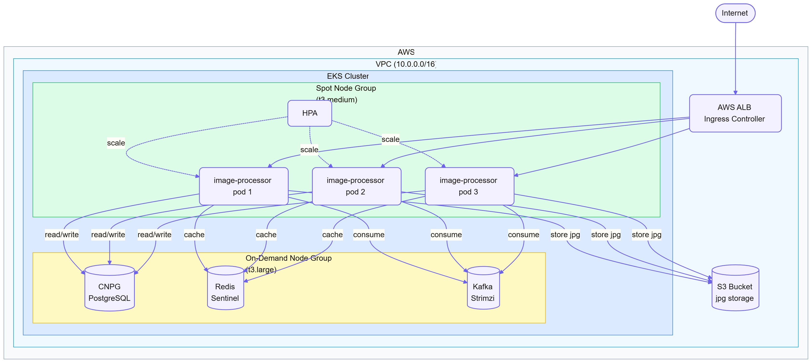

# Java alkalmazás – EKS környezet

## Az alkalmazásról

Az `image-processor` egy Spring Boot 3 alapú üzenetfeldolgozó szolgáltatás. Kafkáról olvas be képfeldolgozási kéréseket, a JPG fájlokat AWS S3-ba menti, a feldolgozás metaadatait PostgreSQL-be írja, az eredményeket Redisben cache-eli.

**Stack:** Java 21, Spring Boot 3, Kafka, PostgreSQL (CNPG), Redis (Sentinel), AWS S3



---

## EKS cluster

Az EKS clustert Terraform építi fel (`terraform/vpc/` + `terraform/eks/`). A cluster két node groupból áll.

### Node group stratégia

**On-demand node group** (`t3.large`) – stateful workloadok futnak rajta: CNPG, Redis, Kafka. Ezeknek nem megengedhető a spot megszakítás, mert adatvesztést vagy partíció-kiesést okozna.

**Spot node group** (`t3.medium`) – az `image-processor` podok futnak rajta. Az alkalmazás állapot nélküli, Kafka offset-et a Kafka tárolja, így egy pod megszakítása nem jár adatvesztéssel. A spot használata 60–70%-os megtakarítást jelent on-demand áron.

Node affinity-vel kényszerítjük ki melyik workload hova kerül (`nodeSelector` vagy `affinity.nodeAffinity`).

---

## Namespace struktúra

```
java-app-dev
java-app-uat
java-app-staging
java-app-prod
```

Az infrastruktúra komponensek (Kafka, Redis, CNPG) saját namespaceben futnak (`kafka`, `redis`, `cnpg-prod`), a java-app podok onnan érik el őket service DNS-en keresztül.

---

## Komponensek

### Deployment

Az `image-processor` `Deployment`-ként fut, nem `StatefulSet`-ként – az alkalmazás állapot nélküli, a Kafka consumer group gondoskodik az offset kezeléséről.

```yaml
apiVersion: apps/v1
kind: Deployment
metadata:
  name: image-processor
  namespace: java-app-prod
spec:
  replicas: 2
  selector:
    matchLabels:
      app: image-processor
  template:
    metadata:
      labels:
        app: image-processor
    spec:
      serviceAccountName: image-processor
      nodeSelector:
        node-group: spot
      containers:
        - name: image-processor
          image: <ecr-registry>/image-processor:latest
          ports:
            - containerPort: 8080
          envFrom:
            - configMapRef:
                name: image-processor-config
            - secretRef:
                name: image-processor-secret
          startupProbe:
            httpGet:
              path: /actuator/health
              port: 8080
            failureThreshold: 30
            periodSeconds: 5
          livenessProbe:
            httpGet:
              path: /actuator/health/liveness
              port: 8080
            initialDelaySeconds: 0
            periodSeconds: 10
          readinessProbe:
            httpGet:
              path: /actuator/health/readiness
              port: 8080
            initialDelaySeconds: 0
            periodSeconds: 5
          resources:
            requests:
              cpu: 500m
              memory: 512Mi
            limits:
              cpu: 2000m
              memory: 1Gi
          securityContext:
            runAsNonRoot: true
            runAsUser: 1000
            readOnlyRootFilesystem: true
```

**Probe-ok indoklása:**
- `startupProbe`: Spring Boot lassan indul (JVM warmup, Kafka connection) – ez megakadályozza hogy a liveness korán kilője a podot
- `livenessProbe`: ha az alkalmazás belső állapota hibás (pl. deadlock), újraindítja
- `readinessProbe`: Kafka connection vagy DB elérhetőség alapján vezérli mikor kap forgalmat a pod

### Service és Ingress

Az alkalmazás REST API-t is expose-ol (pl. job státusz lekérdezésre):

```yaml
apiVersion: v1
kind: Service
metadata:
  name: image-processor
  namespace: java-app-prod
spec:
  selector:
    app: image-processor
  ports:
    - port: 80
      targetPort: 8080
  type: ClusterIP
---
apiVersion: networking.k8s.io/v1
kind: Ingress
metadata:
  name: image-processor
  namespace: java-app-prod
  annotations:
    kubernetes.io/ingress.class: alb
    alb.ingress.kubernetes.io/scheme: internet-facing
    alb.ingress.kubernetes.io/target-type: ip
spec:
  rules:
    - host: image-processor.example.com
      http:
        paths:
          - path: /
            pathType: Prefix
            backend:
              service:
                name: image-processor
                port:
                  number: 80
```

AWS Load Balancer Controller kezeli az ALB-t. Az ingress IP-mode-ban dolgozik, a podokhoz közvetlenül megy a forgalom (NLB helyett ALB, mert HTTP/HTTPS terminálást is csinál).

### ConfigMap és Secret

```yaml
apiVersion: v1
kind: ConfigMap
metadata:
  name: image-processor-config
  namespace: java-app-prod
data:
  KAFKA_BOOTSTRAP_SERVERS: kafka-kafka-bootstrap.kafka.svc.cluster.local:9092
  KAFKA_TOPIC: image-jobs
  KAFKA_GROUP_ID: image-processor-prod
  REDIS_SENTINELS: redis-sentinel.redis.svc.cluster.local:26379
  REDIS_MASTER: mymaster
  S3_BUCKET: image-processor-prod
  AWS_REGION: eu-central-1
  SPRING_PROFILES_ACTIVE: prod
```

Szenzitív adatok (DB jelszó, Redis jelszó) Kubernetes Secret-ben vannak, amit External Secrets Operator tölt fel AWS Secrets Manager-ből:

```yaml
apiVersion: external-secrets.io/v1beta1
kind: ExternalSecret
metadata:
  name: image-processor-secret
  namespace: java-app-prod
spec:
  refreshInterval: 1h
  secretStoreRef:
    name: aws-secrets-manager
    kind: ClusterSecretStore
  target:
    name: image-processor-secret
  data:
    - secretKey: DB_PASSWORD
      remoteRef:
        key: java-app/prod
        property: db_password
    - secretKey: REDIS_PASSWORD
      remoteRef:
        key: java-app/prod
        property: redis_password
```

### HPA – Horizontal Pod Autoscaler

```yaml
apiVersion: autoscaling/v2
kind: HorizontalPodAutoscaler
metadata:
  name: image-processor
  namespace: java-app-prod
spec:
  scaleTargetRef:
    apiVersion: apps/v1
    kind: Deployment
    name: image-processor
  minReplicas: 2
  maxReplicas: 10
  metrics:
    - type: Resource
      resource:
        name: cpu
        target:
          type: Utilization
          averageUtilization: 70
    - type: Resource
      resource:
        name: memory
        target:
          type: Utilization
          averageUtilization: 80
```

Prod-on minimum 2 replika – HA miatt. A Cluster Autoscaler a spot node groupon szükség szerint új node-okat indít ha a podok nem férnek el.

### NetworkPolicy

```yaml
apiVersion: networking.k8s.io/v1
kind: NetworkPolicy
metadata:
  name: image-processor
  namespace: java-app-prod
spec:
  podSelector:
    matchLabels:
      app: image-processor
  policyTypes:
    - Ingress
    - Egress
  ingress:
    - from:
        - namespaceSelector:
            matchLabels:
              kubernetes.io/metadata.name: ingress-nginx
      ports:
        - port: 8080
  egress:
    - to:
        - namespaceSelector:
            matchLabels:
              kubernetes.io/metadata.name: kafka
      ports:
        - port: 9092
    - to:
        - namespaceSelector:
            matchLabels:
              kubernetes.io/metadata.name: redis
      ports:
        - port: 26379
        - port: 6379
    - to:
        - namespaceSelector:
            matchLabels:
              kubernetes.io/metadata.name: cnpg-prod
      ports:
        - port: 5432
    - to:
        - ipBlock:
            cidr: 0.0.0.0/0
      ports:
        - port: 443
```

Az S3 elérés HTTPS-en megy (443), ezért az egress engedélyezi. Minden más forgalom tiltva.

### ServiceAccount és RBAC

Az S3 eléréshez IRSA-t használunk (IAM Role for Service Accounts) – nem kell AWS credential a Secretben:

```yaml
apiVersion: v1
kind: ServiceAccount
metadata:
  name: image-processor
  namespace: java-app-prod
  annotations:
    eks.amazonaws.com/role-arn: arn:aws:iam::123456789:role/image-processor-prod
```

Az IAM role policy S3-ra vonatkozik:

```json
{
  "Effect": "Allow",
  "Action": ["s3:PutObject", "s3:GetObject", "s3:DeleteObject"],
  "Resource": "arn:aws:s3:::image-processor-prod/*"
}
```

---

## Kafka (Strimzi)

A Strimzi operátor (`k8s/helmfile/`) telepíti a Kafka CRD-ket. A Kafka instance a `k8s/modules/image-processor/kafka.helmfile.yml`-ben van definiálva.

```yaml
apiVersion: kafka.strimzi.io/v1beta2
kind: Kafka
metadata:
  name: kafka
  namespace: kafka
spec:
  kafka:
    replicas: 3
    storage:
      type: persistent-claim
      size: 50Gi
      class: gp3
    config:
      default.replication.factor: 3
      min.insync.replicas: 2
  zookeeper:
    replicas: 3
    storage:
      type: persistent-claim
      size: 10Gi
      class: gp3
```

---

## Redis (Sentinel)

A KubeBlocks operator (`k8s/helmfile/`) kezeli a Redis cluster CR-eket. A KubeBlocks egy Kubernetes-natív operator ami többféle adatbázist kezel egységes CRD-ken keresztül – Redis esetén Sentinel módot használunk. A Redis instance a `k8s/modules/image-processor/redis.helmfile.yml`-ben van:

```yaml
apiVersion: apps.kubeblocks.io/v1alpha1
kind: Cluster
metadata:
  name: redis
  namespace: redis
spec:
  clusterDefinitionRef: redis
  clusterVersionRef: redis-7.0
  terminationPolicy: Delete
  componentSpecs:
    - name: redis
      componentDefRef: redis
      replicas: 3
      resources:
        requests:
          cpu: 200m
          memory: 256Mi
        limits:
          cpu: 1000m
          memory: 1Gi
      volumeClaimTemplates:
        - name: data
          spec:
            accessModes: [ReadWriteOnce]
            resources:
              requests:
                storage: 10Gi
            storageClassName: gp3
    - name: redis-sentinel
      componentDefRef: redis-sentinel
      replicas: 3
```

---

## PostgreSQL adatbázis

A meglévő CNPG clusteren (1. feladat) hozunk létre egy dedikált adatbázist az image-processor számára a `cnpg-database.helmfile.yml`-ben.

---

## Image build és CI/CD

A Docker image multi-stage build-del készül – a build konténerben fordul a Java kód, a runtime image csak a JRE-t tartalmazza.

A `.gitlab-ci.yml` pipeline lépései:
1. **build** – Maven build, tesztek futtatása
2. **docker-build** – multi-stage Docker build
3. **scan** – Trivy image scanning (lásd lent)
4. **push** – push ECR-be
5. **deploy** – helmfile apply a megfelelő env-re

### Trivy image scanning

A Trivy egy nyílt forráskódú vulnerability scanner. A pipeline-ban a `docker-build` után fut, és HIGH/CRITICAL besorolású CVE esetén megakasztja a buildet – így sebezhető image nem kerülhet ECR-be és prod-ra.

Tipikus sebezhetőségi forrás: a base image (`eclipse-temurin:21-jre-alpine`) vagy a Maven függőségek outdated verziói. A Trivy ezeket a NIST NVD és egyéb adatbázisok alapján ellenőrzi.

**Előfeltétel:** a GitLab runnernek el kell érnie az `aquasec/trivy` image-et, és a buildelés során az image-nek elérhetőnek kell lennie lokálisan (Docker-in-Docker). Ha a runner környezetben Trivy nem érhető el, a `trivy-scan` job kikapcsolható az `allow_failure: true` beállítással – de ez csak ideiglenesen ajánlott, és dokumentálni kell miért.

---

## Biztonsági szempontok

- **IRSA**: S3 elérésnél nincs hardkódolt credential, a pod IAM szerepköre adja a jogot
- **External Secrets**: DB és Redis jelszó AWS Secrets Manager-ből töltődik, nem a repóban tárolódik
- **Trivy**: minden image push előtt vulnerability scan
- **Non-root container**: `runAsUser: 1000`, `runAsNonRoot: true`
- **ReadOnly filesystem**: `readOnlyRootFilesystem: true`
- **NetworkPolicy**: csak a szükséges útvonalak engedélyezve

---

## Storage

- **S3**: JPG fájlok hosszú távú tárolása – IRSA-val éri el az alkalmazás
- **Kafka**: persistent PVC (gp3, 50Gi) – WAL és offset tárolás
- **Redis**: persistent PVC (gp3, 10Gi) – opcionális, elsősorban cache, de persistence bekapcsolva
- **PostgreSQL**: CNPG kezeli (100Gi gp3, S3 backup) – az 1. feladatból örökölt setup

Az alkalmazás pod maga nem használ PVC-t – állapot nélküli.
